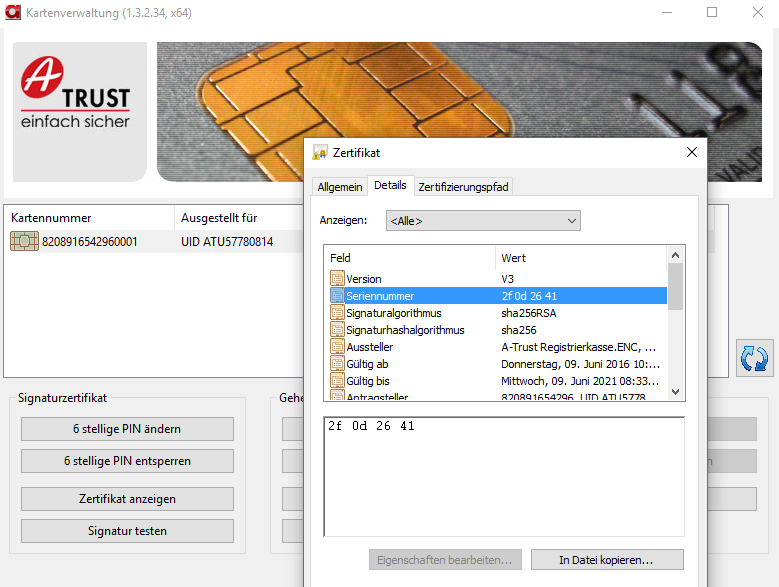

# RKSV certificate serial number
The serial number is part of the certificate and is used to log in to Finanzonline and to operate the cash register (see picture below).

The serial number is sent with activated cards in the form of an accompanying slip.

The serial number can be read from the certificate at any time, this must be done by the cash register software for receipt creation.

To log in to Finanzonline, the serial number can be displayed by the cash register software. Alternatively, the serial number can be read out manually using the following steps:

When using **RK CHIP**:
- From your cash register manufacturer, who can read it from the card
- When using the a-sign Client
- Programatically: [when accessing the card using APDU](https://github.com/A-Trust/RKSV/tree/main/a.sign%20RK%20CHIP/APDU%20Examples)

If the serial number has the value 0000000000, the card is not yet activated and can be activated very easily via the software a.sign Client. 
A tutorial can be found [here](https://github.com/A-Trust/RKSV/tree/main/manuals/asignRKCHIP_activation_en.pdf).

In the last step, a text file is generated, which contains the serial number, the ordinal term and the certificate.

When using **RK Online**:
- From your cash register manufacturer
- When issuing RK-Online in the webshop, a PDF file containing the serial number is offered for download.
- Programatically: [Chapter 2.5 Request certificate information](https://github.com/A-Trust/RKSV/tree/main/a.sign RK CHIP/APDU Examples)

